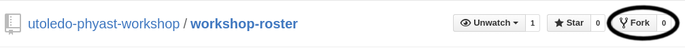
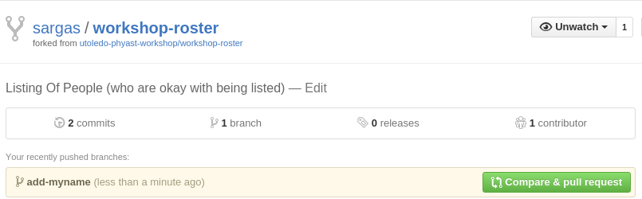

> ## Learning Objectives {.objectives}
>
> *   Explain how to contribute to an established project.

Have you ever found a typo in an open source project? Ever wished your favorite numerical
code would have a built-in option for something you re-implement with every project?

Git makes it easy to help out projects. Let's take an example of a
[workshop roster](https://github.com/utoledo-phyast-workshop/workshop-roster).
If your name is missing, why not add it?

[Fork](reference.html#fork)ing is the operation of creating our own version of a software&mdash;
something GitHub readily encourages. Click the "Fork" button in the upper right corner to create
a version of this repository for your own use.

Forking in GitHub creates a new repository in your account. You have full access to this repository:
consider this a playground to make any changes you'd like. It is easier to make changes to the
repository on your own computer, so clone the repository to have yet another copy:

~~~ {.bash}
$ git clone https://github.com/your-username/workshop-roster.git
~~~
~~~ {.output}
Cloning into 'workshop-roster'...
remote: Counting objects: 8, done.
remote: Compressing objects: 100% (4/4), done.
remote: Total 8 (delta 0), reused 8 (delta 0), pack-reused 0
Unpacking objects: 100% (8/8), done.
Checking connectivity... done.
~~~
Important: the URL should be different for everyone in the workshop.

Now we can work on our changes on a separate branch:

~~~ {.bash}
$ cd workshop-roster/
$ git checkout -b add-myname
$ nano myname.txt
$ git add myname.txt
$ git commit
~~~

Add any information you'd like to the text file you create.

When you have a set of commits that you feel should be merged, there must be some way of
letting someone with commit rights (i.e., the instructor) see the commits. In Linux,
the developers use `git format-patch` to create emailable files listing the changes.

GitHub provides a convenient way of using the website to share code. The concept is called a
[pull request](reference.html#pull-request), in which you ask the project to pull commits from
your work.

To begin, your branch must be pushed to GitHub's repository:

~~~ {.bash}
$ git push origin add-myname
~~~
~~~ {.output}
Username for 'https://github.com': your-username
Password for 'https://your-username@github.com':
Counting objects: 3, done.
Delta compression using up to 8 threads.
Compressing objects: 100% (2/2), done.
Writing objects: 100% (3/3), 281 bytes | 0 bytes/s, done.
Total 3 (delta 1), reused 0 (delta 0)
To https://github.com/sargas/workshop-roster.git
 * [new branch]      add-myname -> add-myname
~~~

GitHub should notice that you just pushed a new branch, and will offer to allow you to submit a pull request for it:

GitHub allows one to fill out the request, giving extra information (like a description of the
branch or justification for why it should be included).

Many times, project developers will have suggestions to improve the pull request. These can
include style guidelines, different approaches, documentation, or testing. Continue to push
to the same branch in order to keep your changes as part of the same pull request. There are
good guides to [updating](https://www.atlassian.com/git/tutorials/rewriting-history/git-rebase)
your branch in light of future changes, and fixing
[conflicts](https://swcarpentry.github.io/git-novice/09-conflict.html) that arise.
